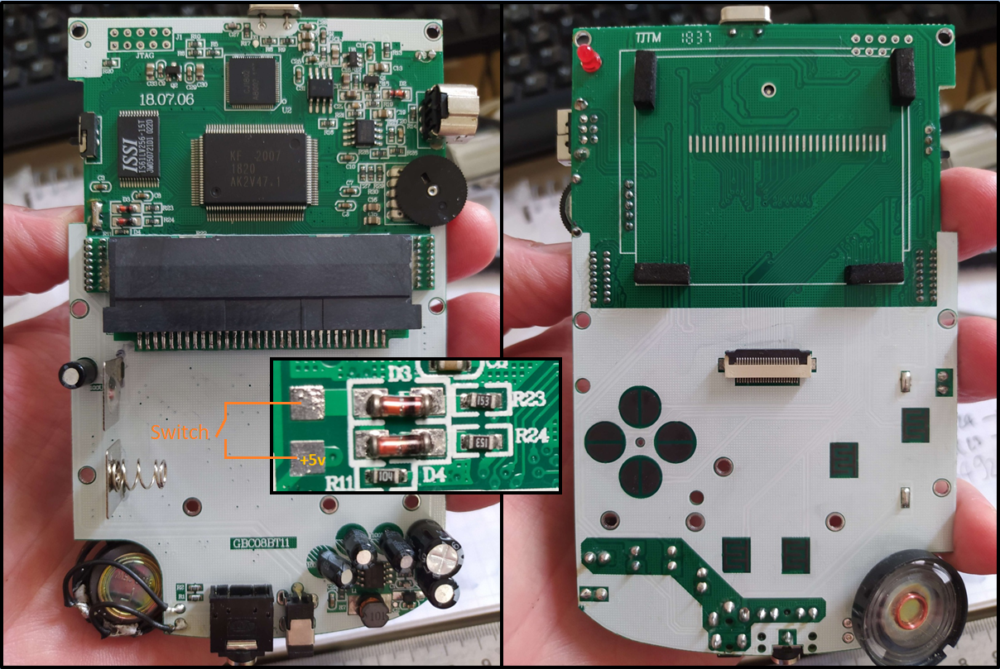
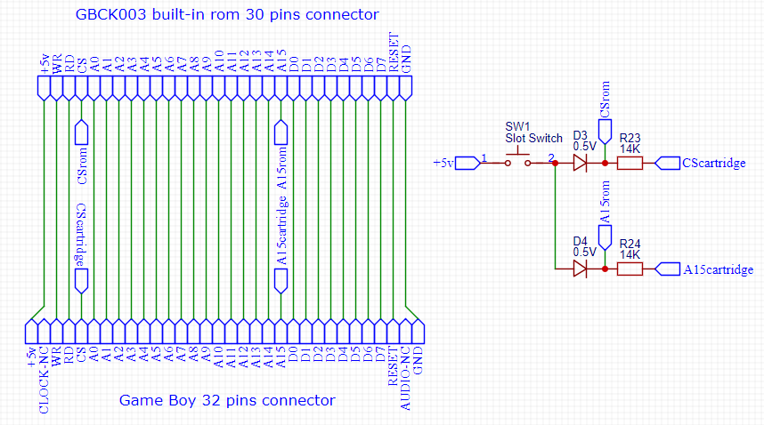
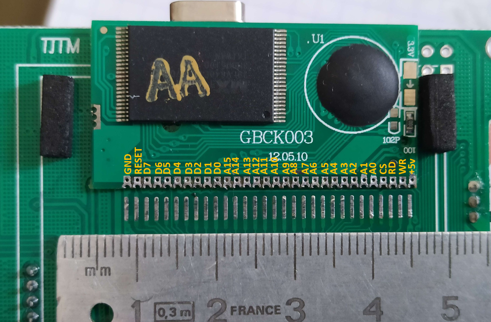
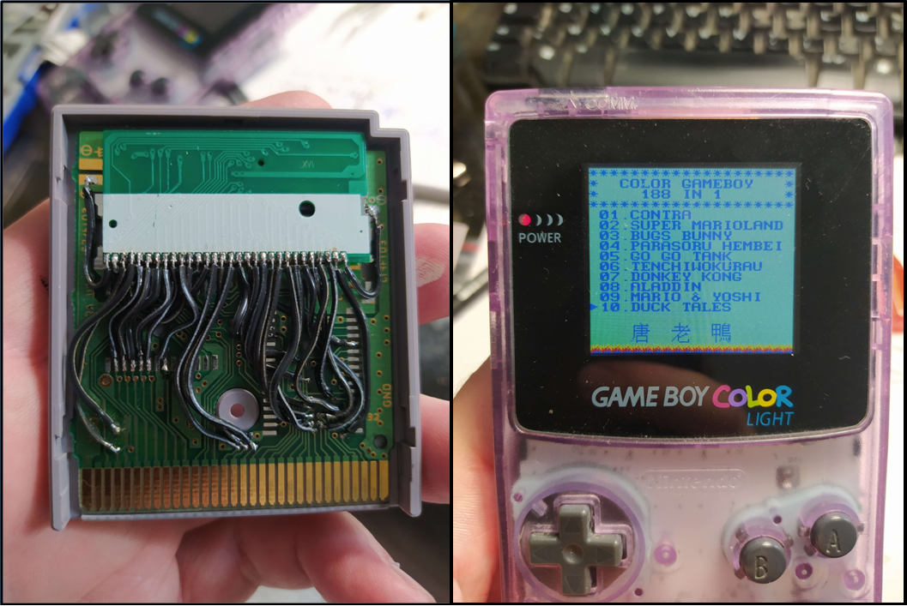
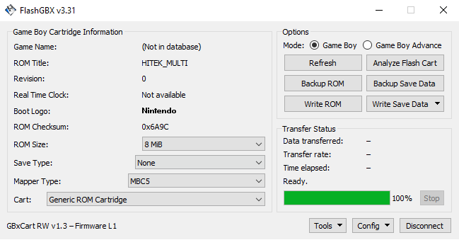
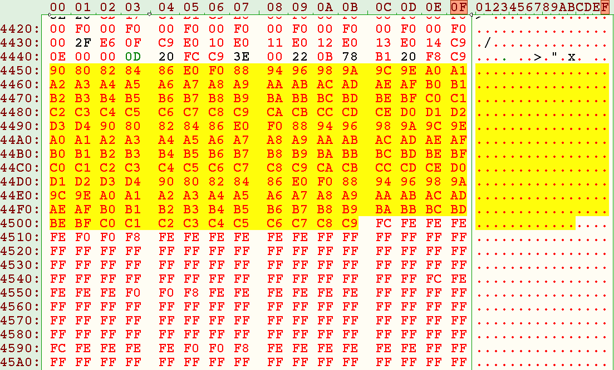
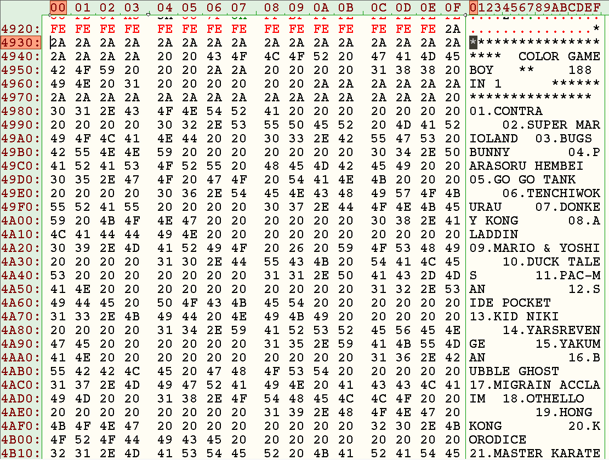
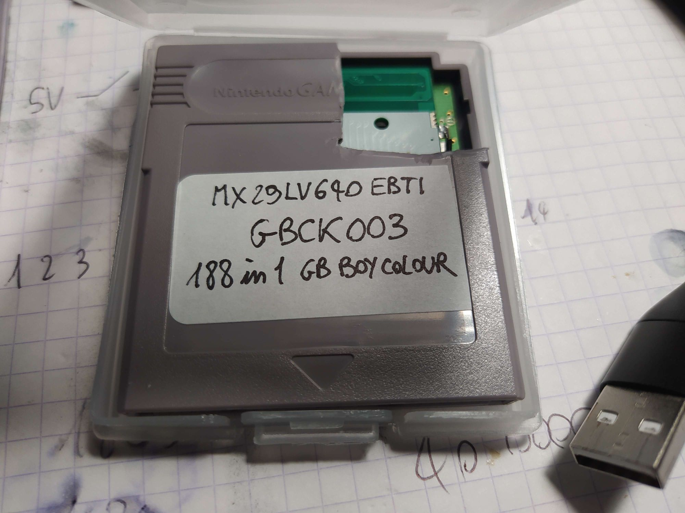

# Knowledge repository about the Kong Feng GB BOY COLOUR

The GB Boy Colour is a Chinese Game Boy Color (GBC) clone from brand new parts made by the [Kong Feng Company](http://furrtek.free.fr/?a=aliname) (KF). The model follows the [GB Boy](http://furrtek.free.fr/?a=gbboy), a Game Boy clone. The GB Boy Colour is now apparently discontinued and replaced by a weird GBA form factor clone (that does not play GBA games). The (laughable) consequence is that the GB Boy Colour in the GBC form factor is now more expensive than a legit GBC in 2023. It's been retro faster than the retro. As usual with Chinese repro, there is no available documentation and the origin of the KF main processor is not documented (reverse engineering or just leak of the masks, who knows...).

## Modded GBC vs GB Boy Colour: note the butchered aspect ratio and the blue hue

The GB Boy Colour features a quite deceptive display in today's standard. It has a pronounced blue hue, a quite dim backlight and a butchered and stretched upscaling. It is driven by an unbranded (and undocumented) video chip turning the legit signal from the main chip into a pixel mess fitting the display. Lover of pixel perfect, move on. Apart from that, the KF main processor is perfectly pinout compatible with a GBC ([it can be directly dropped on a GBC motherboard](https://www.reddit.com/r/Gameboy/comments/qhx2gs/i_swapped_the_cpus_of_a_gb_boy_colour_and_gameboy/)) and the GB Boy Colour itself is a 100% compatible GBC-like console. GB printer and serial functions are perfectly working. IR fonctions are however not connected (there is simply no IR LED wired). GB and GBC regular cartridges are all compatible with the device. Flash cartridges are more or less, essentially due the weak 5V power board (the EZ-Flash jr boots with difficulty due to current draw). The size of the cartridge slot is also a bit off. Re-inserting and wobbling the cartridge is sometimes necessary to boot a game correctly. But it's generally fine for the price it was sold initially (around 30€ shipped from China in 2019). The console is overall better than a non modded GBC regarding ergonomy and was a very appreciable clone before the massive introduction of much better screen mods. Pads and buttons do not feel as cheap as the ones delivered with GBC replacement shells and do the job honestly. START and SELECT are solid and responsive, not like the mushy buttons of the genuine GBC. It is reported that the sound has issues but I think the only reason is that the speaker does not mix the stereo signals. It sounds legit for a casual player at least.

## Modded GBC vs GB Boy Colour: note the butchered aspect ratio and the blue hue

The console comes with a 188-in-one internal rom, labelled GBCK003. It contains in real only 66 different games with repeated entries in the menu. All games are arcade classics of the early Game Boy library, mostly MBC1 and games without mapper (plus there is at least one MBC2 and one MBC5 game), mostly Japanese versions. Two games have save features but they are just broken. 

The PCB is directly soldered to the motherboard (PCB against PCB) and is quite difficult to remove. The GB Boy and the GB Boy Colour seems to share the exact same internal rom. The internal rom is activated only when no cartridge is inserted thanks to a small mechanical switch. In case a cartridge is inserted, it pulls high the A15 and CS lines of the rom board, deactivating it.

## The main board showing the switch circuit for activating/deactivating the internal rom

The front board with the internal rom desoldered is rather empty and lot of room is left behind the display. The display itself is also quite difficult to remove due to very tight tolerance on the ribbon. I did not find the reference despite markings on the ribbon. Next image shows the wiring diagram of the internal rom to the cartridge slot made with a multimeter. The Audio in and Clock pin of Game Boy are of course not connected, reducing the number of pins from 32 to 30.

## Wiring between the 30 pins internal rom and the 32 pins GB compatible cartridge slot.

Side note, the flash chip (29LV640) is rated for 3.3V only and is directly wired to the +5V of the GB Boy Colour. It ran on my side for dozens of hours, but how many more will it survive ? Mystery...

## Detail of the internal rom pinout (flash chip is a 8MB [MX29LV640ETTI-70G](Documentation/MX29LV640E.PDF))

At this point, it is quite "easy" to directly wire the desoldered internal rom to any spare Game Boy cartridge PCB (CS and A15 included). I used a Divastarz PCB for the job, it [died without suffering](https://github.com/Raphael-Boichot/Game-Boy-chips-decapping-project#game-boy-mbc5-mappers) when giving its MBC to Science in a prior project. Wiring all that shit manually pin by pin was a painfull task but at least it works !

## Playing the 188 in 1 cartridge on legit Game Boy Color

## Whole rom analysis (total: 256 banks available)

The rom is quite badly made so the checksum is incorrect (range 0x00014E-0x00014F) and the chip size flag is bad too (offset 0x000148 reports 0x06 for 2MB while it should be 0x08 for 8MB) in the header. The rom indicates that it is driven by a MBC5 compatible mapper which is plausible. Anyway, the dump can be made with FlashGBX and a GBXCart entering the following parameters (do not mind the checksum error, the dump will be good): 

Sadly, the current FlashGBX version does not allow to flash this chip back, only to read it (with a GBxCart 1.3 at least). This mapper/chip combination was not referenced in the FlashGBX database at the time I did the tests despite the chip was used by some previous bootlegs. I've tried many different tricks (like shorting some solder bridges left on the PCB) but it never worked. Maybe the flash chip is simply not meant to be reflashable by the side connectors but only with an external chip flasher and soldered after.

Anyway, The global rom organisation is the following (by increasing offset or increasing banks of 32 kB):

| Data (rom or junk):                  | Size in bytes:          |Starting offset:             |Starting bank:             |
|----------------------------|-------------------------|-----------------------------|-----------------------------|
| HITEK_MULTI      | 0x400000 | 0x000000|0|
| **Junk data**  | **0x3F8000** | **0x080001**|-|
| SUPER MARIOLAND  | 0x010000 | 0x400000|80|
| BUGS BUNNY       | 0x010000 | 0x410000|82|
| PARASORU HEMBEI  | 0x010000 | 0x420000|84|
| GO GO TANK       | 0x010000 | 0x430000|86|
| ALADDIN          | 0x040000 | 0x440000|88|
| CONTRA           | 0x020000 | 0x480000|90|
| MARIO & YOSHI    | 0x010000 | 0x4A0000|94|
| DUCK TALES       | 0x010000 | 0x4B0000|96|
| PAC-MAN          | 0x010000 | 0x4C0000|98|
| SIDE POCKET      | 0x010000 | 0x4D0000|9A|
| KID NIKI         | 0x010000 | 0x4E0000|9C|
| YARSREVENGEAYVE  | 0x010000 | 0x4F0000|9E|
| YAKUMAN          | 0x008000 | 0x500000|A0|
| BUBBLE GHOST     | 0x008000 | 0x508000|A1|
| MIGRAIN ACCLAIM  | 0x008000 | 0x510000|A2|
| OTHELLO          | 0x008000 | 0x518000|A3|
| HONG KONG        | 0x008000 | 0x520000|A4|
| KORODICE         | 0x008000 | 0x528000|A5|
| MASTER KARATEKA  | 0x008000 | 0x530000|A6|
| SHISENSYO        | 0x008000 | 0x538000|A7|
| SHANGHAI         | 0x008000 | 0x540000|A8|
| TENNIS           | 0x008000 | 0x548000|A9|
|  - TRUMP  BOY -  | 0x008000 | 0x550000|AA|
| VOLLEY FIRE      | 0x008000 | 0x558000|AB|
| ALLEY WAY        | 0x008000 | 0x560000|AC|
| PITMAN           | 0x008000 | 0x568000|AD|
| SPACE INVADERS   | 0x008000 | 0x570000|AE|
| ASTEROIDS        | 0x008000 | 0x578000|AF|
| BATTLECITY       | 0x008000 | 0x580000|B0|
| BOMB JACK        | 0x008000 | 0x588000|B1|
| BOXXLE           | 0x008000 | 0x590000|B2|
| BOXXLE2          | 0x008000 | 0x598000|B3|
| AMIDA            | 0x008000 | 0x5A0000|B4|
| TETRIS           | 0x008000 | 0x5A8000|B5|
| BRAINBENDER      | 0x008000 | 0x5B0000|B6|
| TIC-TAC-TOE      | 0x008000 | 0x5B8000|B7|
| CASTELIAN        | 0x008000 | 0x5C0000|B8|
| CENTIPEDE        | 0x008000 | 0x5C8000|B9|
| CRYSTAL QUEST    | 0x008000 | 0x5D0000|BA|
| DRAGON SLAYER 1  | 0x008000 | 0x5D8000|BB|
| DROPZONE         | 0x008000 | 0x5E0000|BC|
| DR.MARIO         | 0x008000 | 0x5E8000|BD|
| FLAPPY SPECIAL   | 0x008000 | 0x5F0000|BE|
| FLIPULL          | 0x008000 | 0x5F8000|BF|
| HEIANKYO ALIEN   | 0x008000 | 0x600000|C0|
| HYPERLODERUNNER  | 0x008000 | 0x608000|C1|
| KLAX             | 0x008000 | 0x610000|C2|
| KOI WA KAKEHIKI  | 0x008000 | 0x618000|C3|
| KWIRK            | 0x008000 | 0x620000|C4|
| LOOPZ            | 0x008000 | 0x628000|C5|
| THEGAMEOFHARMONY | 0x008000 | 0x630000|C6|
| MINESWEEPER      | 0x008000 | 0x638000|C7|
| MISSILE COMMAND  | 0x008000 | 0x640000|C8|
| MOTOCROSSMANIACS | 0x008000 | 0x648000|C9|
| NFL FOOTBALL     | 0x008000 | 0x650000|CA|
| PALAMEDES        | 0x008000 | 0x658000|CB|
| PENGUIN LAND     | 0x008000 | 0x660000|CC|
| PIPE DREAM       | 0x008000 | 0x668000|CD|
| POP UP           | 0x010000 | 0x670000|CE|
| QBILLION         | 0x008000 | 0x680000|D0|
| SERPENT          | 0x008000 | 0x688000|D1|
| TESSERAE         | 0x008000 | 0x690000|D2|
| WORLD BOWLING    | 0x008000 | 0x698000|D3|
| DAEDALIAN OPUS   | 0x008000 | 0x6A0000|D4|
| **Unknown data**   | **0x058000** | **0x6A8001**|-|
| TENCHIWOKURAU    | 0x080000 | 0x700000|E0|
| DONKEY KONG      | 0x080000 | 0x780000|F0|

The first part of the 8MB rom is a giant 4MB partition with mainly junk data except on bank 0x00. The GB Boy boot rom itself (HITEK_MULTI) contains the "filesystem" and a library of tiles for dealing with the western and Chinese characters displayed on screen and is limited to the first 32 KB of data only. The "filesytem" itself is quite simple to grasp: from offset 0x004450 to 0x00450B it contains an array with the "188" starting bank numbers of the "188" targeted roms (starting at 0x000000 for bank 0x00, 0x008000 for bank 0x01, 0x010000 for bank 0x02, etc.).

## Bank #00, the HITEK_MULTI boot rom

- 0x000000 - 0x000150: Game Boy starting code (Game Boy logo, MBC type, rom size, checksum, etc.). The information section provided indicates a non-Japanese 2 MB unlicensed GBC exclusive game with MBC5 + 128 kB ram + battery with a bad checksum. This part is maybe a copy/paste from another game. However no documented game has this checksum...
- 0x000151 - 0x004000: nothing but 0x00, codes jumps directly to 0x004001 (no idea why).
- 0x004001 - 0x00444F: internal code.
- 0x004450 - 0x00450B: array of starting banks for the "188" games.
- 0x00450C - 0x004684: unknown data.
- 0x004685 - 0x00492E: tileset for ASCII table, probably 1 bpp partial ASCII table compressed into 2 bpp tiles so it's very hard to visualize with a tile editor as 2 characters are overlapping in each tile. Only uppercase letters, numbers and some extra characters are possible (basically characters 0x20 to 0x5F of the ASCII table).
- 0x00492F - 0x00582F: tilemap for ASCII table, which appears in [plain ASCII](Dump/HITEK_MULTI.txt) and of course in the same order as the starting bank array of the corresponding rom. Each game has a 20 characters (tiles) reserved space.
- 0x005830 - 0x006708: tilemap for Chinese characters corresponding to each game in the same order. Each game has a 20 characters reserved space too (not sure of the encoding as it occupies 2 lines so 40 tiles on screen, a character targeting 2 vertical tiles).
- 0x006709 - 0x008000: tileset for Chinese characters, probably also 1 bpp compressed in 2 bpp tiles.

## Array of starting banks for roms in the same order as the games in menu

The better (according to Chinese players taste) roms are intentionnaly placed on the first and second menu pages. Quite a decent selection I must admit.

## Tilemap for menu text in plain ASCII

This tilemap can be opened directly in a text editor. It is not natively formatted of course.

## From bank #01 to bank #7F, junk data

Next (after bank 0) is probably data from another project that was stored on the flash chip at some point (chip may have been recycled and not fully erased when flashed). It contains SD and FAT system error codes, a list of Atari 2600 games and some chunks of their roms. From offset 0x0111D00 to 0x0400000 it then contains only 0xFF but I think this is still part of the junk data. Nothing salty at first glance. This probably easily explains why the checksum is bad as it must be calculated without all that crap. 

## From bank #80 to bank #FF, the game roms

Next 4 MB (second half) is occupied by 66 unique roms, without any particular sorting except for the last two. Roms are just aligned to offsets multiple of their own size which is mandatory for multigame systems knowing how the dedicated mappers deals with them (they basically redirect any in-game call to an address to the rom offset OR the address called). Strange thing: DAEDALIAN OPUS is supposed to be a 32 KB rom but its "slot" is in fact 393 KB long or 11 banks (the rom is followed by 0x00 until TENCHIWOKURAU). This is probably just a sloppy offset alignement trick for the next "big" games, DONKEY KONG (MBC1 + save ram) and TENCHIWOKURAU (MBC2). They both have save capabilities in theory, but as far as I can tell, they are just broken here. YARSREVENGE is in its MBC5 version here (GBC) but the rom is 64kB while it is supposed to be 1024 kB. Not sure why.

I do not know if banks #01 to #7F can be used for storing roms but there is clearly no reason that it shouldn't. The Game entries for 188 games can all be stuffed with different names (at least ASCII ones) and the array of starting banks too.

The mapper ([Decapped and imaged](Pictures/kong-feng_gbck003_mcmaster_mz_mit20x.jpg) by [John McMaster](https://twitter.com/johndmcmaster)) is maybe common with some other 1XX-in-one clone cartridges but I did not find any documented matching chip used in bootlegs for the moment. It's probably an Altera CPLD.

I did not find any emulator that can boot this rom (even the trusty BGB, which supports many oddities), which means it's a bootleg thing not derived from known and documented stuff.

With all this knowledge in hand and a way of reflashing this PCB (probably by desoldering the flash chip or adding some wires between connector and chip), it is probably possible to make a working custom rom by tinkering this one without too much difficulty. I guess it would anyway be easier to solder back a [known-to-be-reflashable-and-customisable 108-in-1 cartridge](https://github.com/lesserkuma/256M_ROM_Builder) with some adapter PCB rather than trying to mess with that piece of crap. There is plenty of room below the LCD screen.

## The most unique and janky cartmod ever

